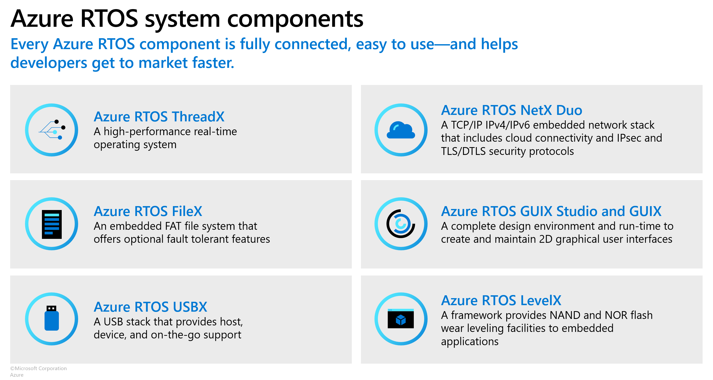

# Azure RTOS

Azure RTOS is an embedded development suite including a small but powerful operating system that provides reliable, ultra-fast performance for resource-constrained devices.

In addition to the Azure RTOS ThreadX, which is the kernel of RTOS, Azure RTOS provides a set of system components to accelerate building embedded systems and IoT applications.

You can find all source code of Azure RTOS system components organized by individual repositories.

Here are some links that can help you bootstrap with developing with Azure RTOS:

- [Product overview](https://learn.microsoft.com/azure/rtos/overview-rtos)
- [Getting started guides](https://github.com/azure-rtos/getting-started) and [sample projects](https://github.com/azure-rtos/samples)
- [Pre-licensed devices](https://github.com/azure-rtos/threadx/blob/master/LICENSED-HARDWARE.txt) and [licensing options](https://aka.ms/azrtos-license)
- [General technical questions](https://aka.ms/QnA/azure-rtos)
- [Releases and long term support (LTS)](https://learn.microsoft.com/azure/rtos/general/lts)

Visit [https://azure.com/rtos](https://azure.com/rtos) to learn more about the product and licensing information.
